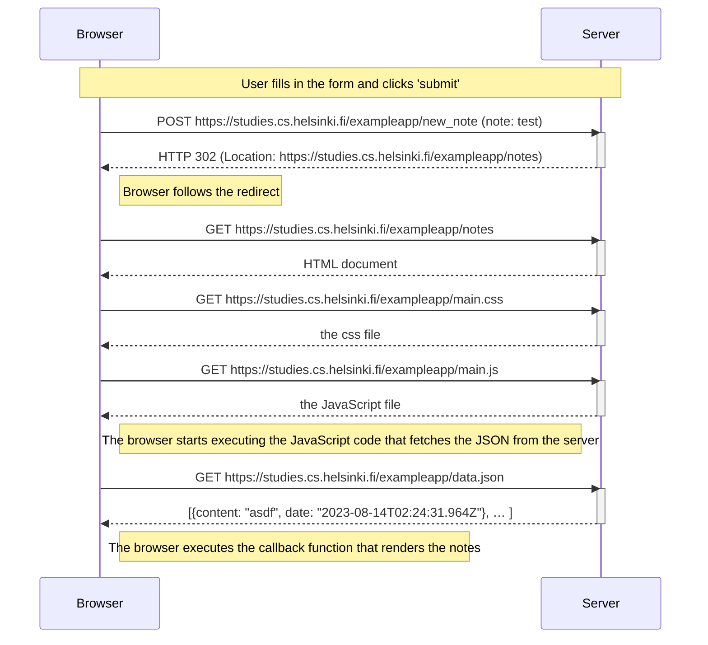

```mermaid
sequenceDiagram
    participant browser as Browser
    participant server as Server

    Note over browser, server: User fills in the form and clicks 'submit'

    browser->>server: POST https://studies.cs.helsinki.fi/exampleapp/new_note (note: test)
    activate server

    server-->>browser: HTTP 302 (Location: https://studies.cs.helsinki.fi/exampleapp/notes)
    deactivate server

    Note right of browser: Browser follows the redirect

    browser->>server: GET https://studies.cs.helsinki.fi/exampleapp/notes
    activate server
    server-->>browser: HTML document
    deactivate server

    browser->>server: GET https://studies.cs.helsinki.fi/exampleapp/main.css
    activate server
    server-->>browser: the css file
    deactivate server

    browser->>server: GET https://studies.cs.helsinki.fi/exampleapp/main.js
    activate server
    server-->>browser: the JavaScript file
    deactivate server

    Note right of browser: The browser starts executing the JavaScript code that fetches the JSON from the server

    browser->>server: GET https://studies.cs.helsinki.fi/exampleapp/data.json
    activate server
    server-->>browser: [{content: "asdf", date: "2023-08-14T02:24:31.964Z"}, … ]
    deactivate server

    Note right of browser: The browser executes the callback function that renders the notes
```