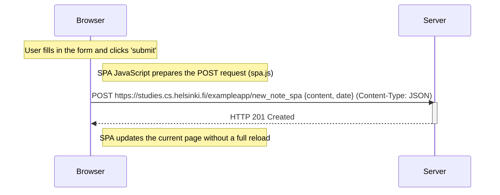

```mermaid
sequenceDiagram
    participant browser as Browser
    participant server as Server

    Note over browser: User fills in the form and clicks 'submit'

    Note right of browser: SPA JavaScript prepares the POST request (spa.js)
    
    browser->>server: POST https://studies.cs.helsinki.fi/exampleapp/new_note_spa {content, date} (Content-Type: JSON)
    activate server
    
    server-->>browser: HTTP 201 Created
    deactivate server

    Note right of browser: SPA updates the current page without a full reload
```